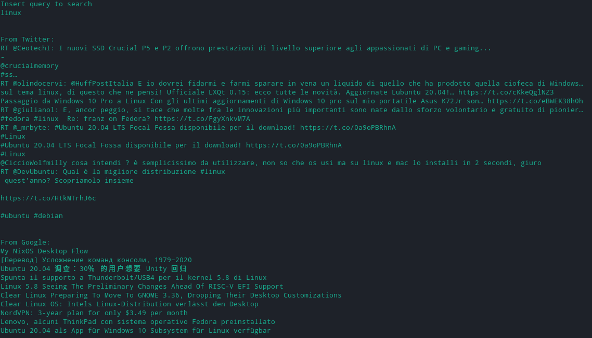

# feedme

## Getting Started

This project was born as a way to learn python and API basics, it consists
in a news collector based on the user query.
For now I'm improving the project to give the user the possibility to user the
application just running a simple command.

### Installing
If you want anyway try this program you should follow these steps:

* git clone "https://github.com/fulviodenza/feed-collector.git"
* generate a twitter and google news API key
* writing a simple "config_google.py" and "config_twitter.py" in which you will insert these keys
* python main.py
* keep informed
